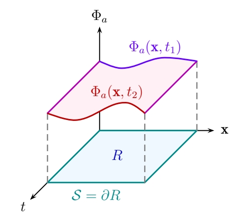

---
puppeteer:
  displayHeaderFooter: true
  headerTemplate: ''
  footerTemplate: '
    

     / 
    
    

    '
---

## 由变分法导出经典力学&场论中的运动方程

> $Collapsar,Aug\ 1,2024$

[TOC]

### 经典力学

#### 质点系统的欧拉-拉格朗日方程
对于$n$个自由度的质点系统,其作用量$S$的定义为拉格朗日量$L(q_i,\dot{q}_i)$的时间积分
$$S=\int_{t_1}^{t_2}\text{d}tL(q_i,\dot{q}_i),\tag{1}$$
其中,$q_i,\dot{q}_i\equiv\dfrac{\text{d}q_i}{\text{d}t}$分别为系统的广义坐标和广义速度.

最小作用量原理指出,作用量的变分极值($\delta S=0$)}
对应于系统的经典运动轨迹.

以下假设不作时间坐标的变换,即时间的变分$\delta t=0$.

由于变分运算$\delta$与微分$\text{d}$或者微商运算可以交换次序,所以有
$$\delta \dot{q}_i=\delta\dfrac{\text{d}q_i}{\text{d}t}=\dfrac{\text{d}}{\text{d}t}\delta q_i,\tag{2}$$
表明时间导数的变分等于变分的时间导数.

对式$(1)$左右两边取变分,考虑到变分运算$\delta$和积分运算$\displaystyle \int$也可以交换次序,所以有
$$
\delta S=\delta \int_{t_1}^{t_2}\text{d}tL(q_i,\dot{q}_i)=\int_{t_1}^{t_2}\text{d}t\delta L(q_i,\dot{q}_i),\tag{3}
$$
复合函数$L(q_i,\dot{q}_i)$的变分运算法则与微分运算法则完全相同,只需要将微分运算的$\text{d}$换成$\delta$,即
$$\delta L(q_i,\dot{q}_i)=\dfrac{\partial L}{\partial q_i}\delta q_i+\dfrac{\partial L}{\partial \dot{q}_i}\delta \dot{q}_i
\xlongequal{\delta \dot{q}_i=\frac{\text{d}}{\text{d}t}\delta q_i}
\dfrac{\partial L}{\partial q_i}\delta q_i+\dfrac{\partial L}{\partial \dot{q}_i}\dfrac{\text{d}}{\text{d}t}\delta q_i,\tag{4}$$
后一个等号用到了式$(2)$.
利用分部积分,式$(4)$最右边一项可以改写为
$$\dfrac{\partial L}{\partial \dot{q}_i}\dfrac{\text{d}}{\text{d}t}\delta q_i=\dfrac{\text{d}}{\text{d}t}\left( \dfrac{\partial L}{\partial \dot{q}_i}\delta q_i\right)-\left(\dfrac{\text{d}}{\text{d}t} \dfrac{\partial L}{\partial \dot{q}_i}\right)\delta q_i,\tag{5}$$
代入到$(4)$就有
$$
\begin{aligned}
\delta L(q_i,\dot{q}_i)&=\dfrac{\partial L}{\partial q_i}\delta q_i+\dfrac{\text{d}}{\text{d}t}\left( \dfrac{\partial L}{\partial \dot{q}_i}\delta q_i\right)-\left(\dfrac{\text{d}}{\text{d}t} \dfrac{\partial L}{\partial \dot{q}_i}\right)\delta q_i
\\
&=\left(\dfrac{\partial L}{\partial q_i}-\dfrac{\text{d}}{\text{d}t} \dfrac{\partial L}{\partial \dot{q}_i}\right)\delta q_i
+\dfrac{\text{d}}{\text{d}t}\left( \dfrac{\partial L}{\partial \dot{q}_i}\delta q_i\right).
\end{aligned}
\tag{6}
$$
于是式$(3)$为
$$
\begin{aligned}
\delta S&=\int_{t_1}^{t_2}\text{d}t\delta L(q_i,\dot{q}_i)\\
&=\int_{t_1}^{t_2}\text{d}t\left[\left(\dfrac{\partial L}{\partial q_i}-\dfrac{\text{d}}{\text{d}t} \dfrac{\partial L}{\partial \dot{q}_i}\right)\delta q_i
+\dfrac{\text{d}}{\text{d}t}\left( \dfrac{\partial L}{\partial \dot{q}_i}\delta q_i\right)\right]\\
&=\int_{t_1}^{t_2}\left[\text{d}t\left(\dfrac{\partial L}{\partial q_i}-\dfrac{\text{d}}{\text{d}t} \dfrac{\partial L}{\partial \dot{q}_i}\right)\delta q_i
+\text{d}\left( \dfrac{\partial L}{\partial \dot{q}_i}\delta q_i\right)\right]\\
&=\int_{t_1}^{t_2}\text{d}t\left(\dfrac{\partial L}{\partial q_i}-\dfrac{\text{d}}{\text{d}t} \dfrac{\partial L}{\partial \dot{q}_i}\right)\delta q_i
+\int_{t_1}^{t_2}\text{d}\left( \dfrac{\partial L}{\partial \dot{q}_i}\delta q_i\right)\\
&=\int_{t_1}^{t_2}\text{d}t\left(\dfrac{\partial L}{\partial q_i}-\dfrac{\text{d}}{\text{d}t} \dfrac{\partial L}{\partial \dot{q}_i}\right)\delta q_i
+\left. \dfrac{\partial L}{\partial \dot{q}_i}\delta q_i\right|_{t_1}^{t_2},
\end{aligned}
\tag{7}
$$
假设初始和结束时刻广义坐标的变分为零,即$\delta q_i(t_1)=\delta q_i(t_2)=0$,于是上式最后一行第二项为零.又因为变分$\delta q_i(t)$在$t_1<t<t_2$时任意,所以$\delta S=0$将会导致

$$\dfrac{\partial L}{\partial q_i}-\dfrac{\text{d}}{\text{d}t} \dfrac{\partial L}{\partial \dot{q}_i}=0,i=1,\cdots,n\tag{8}$$

 
这就是描述质点系统经典运动的欧拉-拉格朗日方程.

#### 质点系统的哈密顿正则方程

引入广义动量
$$
p_i\equiv\dfrac{\partial L}{\partial \dot{q}_i},i=1,\cdots,n.
\tag{9}$$
求解上述方程,将广义速度表示为$q_i,p_i$的函数$\dot{q}_i(q_i,p_i)$,通过$Legendre$变换定义哈密顿量
$$H(q_i,p_i)\equiv p_i\dot{q}_i-L,\tag{10}$$
用$H$取代$L$来表示作用量$S$,
$$
S= \int_{t_1}^{t_2}\text{d}tL(q_i,\dot{q}_i)=\int_{t_1}^{t_2}\text{d}t\left[ p_i\dot{q}_i-H(q_i,p_i)\right],\tag{11}
$$
对上式左右两边取变分,注意到
$$
\begin{aligned}
\delta \left(p_i\dot{q}_i\right)&=\delta p_i\dot{q}_i+p_i\delta\dot{q}_i\xlongequal{\delta \dot{q}_i=\frac{\text{d}}{\text{d}t}\delta q_i}\delta p_i\dot{q}_i+p_i\dfrac{\text{d}}{\text{d}t}\delta q_i\\
&=\delta p_i\dot{q}_i+\dfrac{\text{d}}{\text{d}t}\left(p_i \delta q_i
\right)-\dfrac{\text{d}p_i}{\text{d}t}\delta q_i,
\end{aligned}
\tag{12}$$
以及
$$
\delta H(q_i,p_i)=\dfrac{\partial H}{\partial q_i}\delta q_i+\dfrac{\partial H}{\partial p_i}\delta p_i,\tag{13}
$$
于是就有

$$\begin{aligned}
\delta S&=\delta\int_{t_1}^{t_2}\text{d}t\left[ p_i\dot{q}_i-H(q_i,p_i)\right]=\int_{t_1}^{t_2}\text{d}t\delta\left[ p_i\dot{q}_i-H(q_i,p_i)\right]    \\
&=\int_{t_1}^{t_2}\text{d}t\left[\delta (p_i\dot{q}_i)-\delta H(q_i,p_i)\right] 
\\&=\int_{t_1}^{t_2}\text{d}t\left[ \left(\dot{q}_i-\dfrac{\partial H}{\partial p_i}\right)\delta p_i+\dfrac{\text{d}}{\text{d}t}(p_i\delta q_i)-\left(\dot{p}_i+\dfrac{\partial H}{\partial q_i}\right)\delta q_i\right]\\
&=\int_{t_1}^{t_2}\text{d}t \left(\dot{q}_i-\dfrac{\partial H}{\partial p_i}\right)\delta p_i+\int_{t_1}^{t_2}\text{d}(p_i\delta q_i)-\int_{t_1}^{t_2}\text{d}t\left(\dot{p}_i+\dfrac{\partial H}{\partial q_i}\right)\delta q_i\\
&=\int_{t_1}^{t_2}\text{d}t \left(\dot{q}_i-\dfrac{\partial H}{\partial p_i}\right)\delta p_i+(\left.p_i\delta q_i)\right|_{t_1}^{t_2}-\int_{t_1}^{t_2}\text{d}t\left(\dot{p}_i+\dfrac{\partial H}{\partial q_i}\right)\delta q_i,
\end{aligned}
\tag{14}
$$
上式最后一行第二项同样由于初始和结束时刻变分为零而消失,而且$\delta p_i,\delta q_i$任意,于是作用量的变分为零将会导致

$$
\left\{
\begin{aligned}
\dot{q}_i&=\dfrac{\partial H}{\partial p_i},\\
\dot{p}_i&=-\dfrac{\partial H}{\partial q_i}.
\end{aligned}
\right.
\quad i=1,\cdots,n.\tag{15}
$$

 
这就是哈密顿正则运动方程,相当于用$2n$个一阶方程代替原来的$n$个二阶欧拉-拉格朗日方程.广义坐标$q_i$与广义动量$p_i$统称为正则变量.

---

### 场论

#### 场的欧拉-拉格朗日方程

经典场论中,场$\phi(\boldsymbol{x},t)$是系统的广义坐标.局域场论中,拉格朗日量表示为$\displaystyle L(t)=\int\text{d}^3x\mathcal{L}(x)$,其中,$\mathcal{L}(x)$为拉格朗日量密度,简称拉氏量,并且假设它是系统中$n$个场$\phi_{a}(\boldsymbol{x},t),a=1,\cdots,n$及其时空导数$\partial_\mu \phi_a$的函数,即$\mathcal{L}=\mathcal{L}[\phi_{a}(\boldsymbol{x},t),\partial_\mu \phi_a]$.如此,作用量可以表达为
$$
S=\int\text{d}t L=\int \text{d}^4x\mathcal{L}(\phi_a,\partial_\mu\phi_a)
,\tag{16}
$$

上图描绘了时空区域$R$上的场$\phi_a(\boldsymbol{x},t)$,其中$\boldsymbol{x}$表示三维空间坐标.$S=\partial R$为$R$的边界面.假设不作时空坐标的变换,即时空坐标的变分$\delta x^\mu=0$,那么对场的时空导数的变分等于场的变分的时空导数,

$$\delta(\partial_\mu\phi_a)=\partial_\mu(\delta\phi_a).\tag{17}$$

于是拉式量的变分为
$$
\begin{aligned}
\delta\mathcal{L}&=\dfrac{\partial  \mathcal{L}}{\partial \phi_a}\delta \phi_a+\dfrac{\partial  \mathcal{L}}{\partial (\partial_\mu\phi_a)}\delta(\partial_\mu\phi_a)\\
&\xlongequal{\delta(\partial_\mu\phi_a) = \partial_\mu(\delta\phi_a)}\dfrac{\partial  \mathcal{L}}{\partial \phi_a}\delta \phi_a+\dfrac{\partial  \mathcal{L}}{\partial (\partial_\mu\phi_a)}\partial_\mu(\delta\phi_a),
\end{aligned}
\tag{18}
$$
利用分部积分,将上式第二行第二项改写为
$$
\dfrac{\partial  \mathcal{L}}{\partial (\partial_\mu\phi_a)}\partial_\mu(\delta\phi_a)=\partial_\mu\left(\dfrac{\partial  \mathcal{L}}{\partial (\partial_\mu\phi_a)}\delta\phi_a\right)-\partial_\mu\left[\dfrac{\partial  \mathcal{L}}{\partial (\partial_\mu\phi_a)}\right]\delta\phi_a
,\tag{19}$$

于是作用量$S$的变分为
$$
\begin{aligned}
\delta S&=\int \text{d}^4x \delta \mathcal{L}(\phi_a,\partial_\mu\phi_a)\\
&=\int \text{d}^4x \left\{
\dfrac{\partial  \mathcal{L}}{\partial \phi_a}\delta \phi_a+\partial_\mu\left(\dfrac{\partial  \mathcal{L}}{\partial (\partial_\mu\phi_a)}\delta\phi_a\right)-\partial_\mu\left(\dfrac{\partial  \mathcal{L}}{\partial (\partial_\mu\phi_a)}\right)\delta\phi_a\\
\right\}\\
&=\int \text{d}^4x \left\{
\left[\dfrac{\partial  \mathcal{L}}{\partial \phi_a}-\partial_\mu\left(\dfrac{\partial  \mathcal{L}}{\partial (\partial_\mu\phi_a)}\right)\right]\delta \phi_a+\partial_\mu\left(\dfrac{\partial  \mathcal{L}}{\partial (\partial_\mu\phi_a)}\delta\phi_a\right)
\right\}\\
&=\int \text{d}^4x 
\left[\dfrac{\partial \mathcal{L}}{\partial \phi_a}-\partial_\mu\left(\dfrac{\partial  \mathcal{L}}{\partial (\partial_\mu\phi_a)}\right)\right]\delta \phi_a+\int\text{d}^4x\partial_\mu\left(\dfrac{\partial  \mathcal{L}}{\partial (\partial_\mu\phi_a)}\delta\phi_a\right),
\end{aligned}
\tag{20}
$$
上式最后一行第二项是关于时空坐标的散度,利用$Stokes$公式将其改写为对于积分区域边界面$S$的积分
$$
\int\text{d}^4x\partial_\mu\left(\dfrac{\partial  \mathcal{L}}{\partial (\partial_\mu\phi_a)}\delta\phi_a\right)=\int_S\text{d}s\dfrac{\partial  \mathcal{L}}{\partial (\partial_\mu\phi_a)}\delta\phi_a,\tag{21}
$$
其中$\text{d}s$是$S$上的面元,并且假设边界面$S$上面$\delta \phi=0$,则上式为零.
通常讨论时空区域上的场,相当于假设无穷远时空边界上$\delta \phi=0$.如此,$\delta S=0$将会导致

$$
\dfrac{\partial \mathcal{L}}{\partial \phi_a}-\partial_\mu\left[\dfrac{\partial  \mathcal{L}}{\partial (\partial_\mu\phi_a)}\right]=0,a=1,\cdots,n,\tag{22}
$$

 
这就是场的欧拉-拉格朗日方程.

#### 场的哈密顿正则方程

场的共轭动量密度或者正则共轭场定义为
$$
\pi_a(\boldsymbol{x},t)\equiv\dfrac{\partial\mathcal{L}}{\partial\dot{\phi}_a}.\tag{23}
$$
通过$Legendre$变换定义哈密顿量为
$$
H\equiv\int\text{d}^3x\mathcal{H}=\int \text{d}^3x\pi_a\dot{\phi}_a-L,\tag{24}
$$
其中$\mathcal{H}(\phi_a,\pi_a,\nabla\phi_a)=\pi_a\dot{\phi}_a-\mathcal{L}$为哈密顿量密度.
于是拉氏量的变分为
$$\delta \mathcal{L}=\delta(\pi_a\dot{\phi}_a-\mathcal{H})=
\delta \pi_a\dot{\phi}_a+\pi_a\delta\dot{\phi}_a-\delta \mathcal{H}.\tag{25}$$
利用分部积分改写上式中的$\pi_a\delta\dot{\phi}_a$
$$
\pi_a\delta\dot{\phi}_a=\pi_a\delta\dfrac{\text{d}\phi_a}{\text{d}t}=\dfrac{\text{d}}{\text{d}t}(\pi_a\delta\phi_a)-\dfrac{\text{d}\pi_a}{\text{d}t}\delta\phi_a.\tag{26}
$$
而$\mathcal{H}=\mathcal{H}(\phi_a,\pi_a,\nabla\phi_a)$的变分为
$$
\begin{aligned}
\delta\mathcal{H}&=\dfrac{\partial \mathcal{H}}{\partial\phi_a}\delta\phi_a+\dfrac{\partial \mathcal{H}}{\partial\pi_a}\delta\pi_a+\dfrac{\partial \mathcal{H}}{\partial(\nabla\phi_a)}\cdot\delta(\nabla\phi_a),
\end{aligned}
\tag{27}
$$
考虑到$\delta(\nabla\phi_a)=\nabla(\delta\phi_a)$以及矢量分析公式
$$\nabla\cdot(f\boldsymbol{g})=\nabla f \cdot \boldsymbol{g}+f\nabla \cdot \boldsymbol{g}\tag{28},$$
其中$f$为标量函数,而$\boldsymbol{g}$为矢量函数.式$(27)$最后一项改写为
$$
\dfrac{\partial \mathcal{H}}{\partial(\nabla\phi_a)}\cdot\nabla(\delta\phi_a)=\nabla\cdot \left[\dfrac{\partial \mathcal{H}}{\partial(\nabla\phi_a)}\delta\phi_a\right]-\delta\phi_a\left[\nabla\cdot\dfrac{\partial \mathcal{H}}{\partial(\nabla\phi_a)}\right],\tag{29}
$$
于是作用量的变分可以表示为
$$
\begin{aligned}
\delta S=&\int \text{d}^4x\delta\mathcal{L}\\
\xlongequal{(25)}&\int \text{d}^4x 
(\delta \pi_a\dot{\phi}_a+\pi_a\delta\dot{\phi}_a-\delta \mathcal{H})\\
\xlongequal{(26),(27)}&\int \text{d}^4x\left[\delta \pi_a\dot{\phi}_a+
\dfrac{\text{d}}{\text{d}t}(\pi_a\delta\phi_a)-\dfrac{\text{d}\pi_a}{\text{d}t}\delta\phi_a
\right]
\\
-&\int\text{d}^4x\left[\dfrac{\partial \mathcal{H}}{\partial\phi_a}\delta\phi_a+\dfrac{\partial \mathcal{H}}{\partial\pi_a}\delta\pi_a+\dfrac{\partial \mathcal{H}}{\partial(\nabla\phi_a)}\cdot\delta(\nabla\phi_a)\right]\\
\xlongequal{(29)}&\int \text{d}^4x\left[\delta \pi_a\dot{\phi}_a+
\dfrac{\text{d}}{\text{d}t}(\pi_a\delta\phi_a)-\dfrac{\text{d}\pi_a}{\text{d}t}\delta\phi_a
\right]
\\
-&\int\text{d}^4x\left\{\dfrac{\partial \mathcal{H}}{\partial\phi_a}\delta\phi_a+\dfrac{\partial \mathcal{H}}{\partial\pi_a}\delta\pi_a+\nabla\cdot \left[\dfrac{\partial \mathcal{H}}{\partial(\nabla\phi_a)}\delta\phi_a\right]-\delta\phi_a\left[\nabla\cdot\dfrac{\partial \mathcal{H}}{\partial(\nabla\phi_a)}\right]\right\}\\
=&\int\text{d}^4x\left(\dot{\phi}_a-\dfrac{\partial \mathcal{H}}{\partial \pi_a}\right)\delta\pi_a-\int\text{d}^4x\left(\dfrac{\partial \mathcal{H}}{\partial \phi_a}+\dot{\pi}_a-\nabla\cdot\dfrac{\partial \mathcal{H}}{\partial(\nabla\phi_a)}\right)\delta\phi_a
\\
+&\int \text{d}^4x\dfrac{\text{d}}{\text{d}t}(\pi_a\delta\phi_a)-\int\text{d}^4x\nabla\cdot \left[\dfrac{\partial \mathcal{H}}{\partial(\nabla\phi_a)}\delta\phi_a\right],\\
\end{aligned}
\tag{30}
$$
上式最后一行的两项由于$\delta\phi_a=0$而消失.所以作用量变分为零必然导致

$$
\left\{
\begin{aligned}
&\dot{\phi}_a=\dfrac{\partial H}{\partial \pi_a},\\
&\dot{\pi}_a=\nabla\cdot\dfrac{\partial \mathcal{H}}{\partial(\nabla\phi_a)}-\dfrac{\partial \mathcal{H}}{\partial \phi_a}.
\end{aligned}
\right.
\tag{31}
$$

 
这就是场的哈密顿正则运动方程.场$\phi_a$和它的共轭动量密度$\pi_a$构成系统的正则变量.